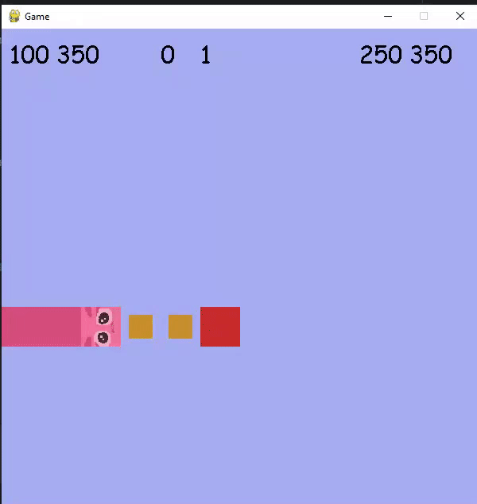

# AI_project_snake

Simple snake algorithm made in pygame. Scores up to 20-30 points.
If pygame is installed, running main should create the window in which snake is already running.

Numbers at the top show apple's coordinates, best score in this run, current points and coordinates of the head.
Red rectangle is the apple.
Yellow points show what path the snake is currently planning.

Console shows current planned path and occasionally error message when such path is not found.

//Notes
//old code, needs imporovement, done in my first semester of uni
//lacks structure, proper comments and usage of naming conventions
